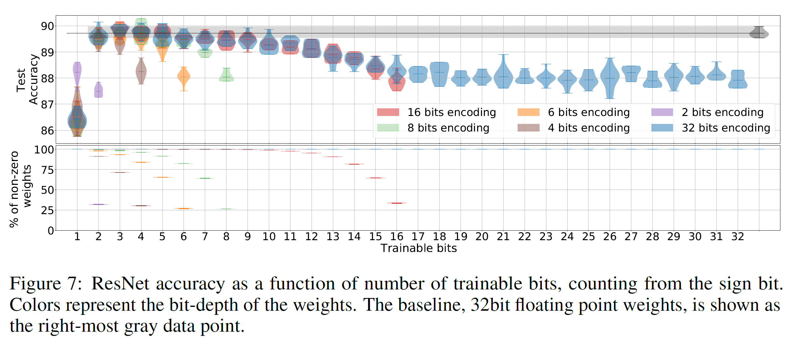

# Bit-wise Training of Neural Network Weights


This repository contains the code for the experiments from the following publication "**Bit-wise Training of Neural Network Weights**". \
Links: [arXiv](https://arxiv.org/abs/2202.09571) or [OpenReview](https://openreview.net/forum?id=gxk4-rVATDA)


## Abstract

We propose an algorithm where the individual bits representing the weights of a neural network are learned. 
This method allows training weights with integer values on arbitrary bit-depths and naturally uncovers sparse 
networks, without additional constraints or regularization techniques. We show better results than the standard 
training technique with fully connected networks and similar performance as compared to standard training for 
residual networks. By training bits in a selective manner we found that the biggest contribution to achieving 
high accuracy is given by the first three most significant bits, while the rest provide an intrinsic 
regularization. As a consequence we show that more than 90% of a network can be used to store arbitrary codes 
without affecting its accuracy. These codes can be random noise, binary files or even the weights of 
previously trained networks.





### Requirements
- Tensorflow 1.15 (does not work with newer versions)


### Usage:

```markdown
python Trainer.py
```

Trainer.py runs the main code. By default, it runs LeNet on MNIST with bit-depth 6. 
Trainable bits are the first 3 most significant ones. The following are untrainable.


